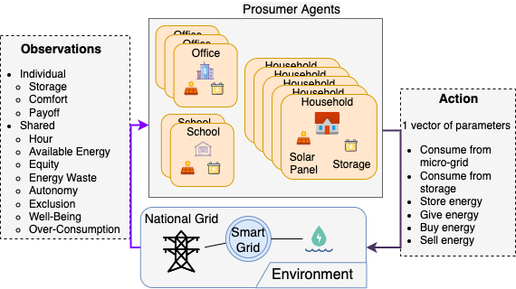

# Summary

The `ethical-smart-grid` package is a reinforcement learning (RL) simulator of a smart grid, based on Gym [@gym].
It focuses on learning *ethical behaviours*, i.e., behaviours that include ethical considerations, and are aligned with moral values.
The simulated smart grid is composed of multiple agents representing inhabitants, which have to learn how to consume and distribute energy while taking into account several ethical considerations, such as the equity of comforts between inhabitants.

This simulator is somewhat simplified compared to existing (co-)simulators [@mihal2022smart; @vogt2018survey; @oliveira2012masgrip; @karnouskos2009simulation]; it focuses instead on the ethical aspects.
In other words, agents that have been trained on this environment could not be deployed in a real-world smart grid, yet this package still serves as a suitable environment for learning ethical behaviours.

The purpose of this work is to present a simple simulator that allows to run (reproducible) simulations, and to compare on a common environment multiple (ethical) decision-making algorithms.
The simulator is implemented in an extensible way to allow third-party researchers to adapt it to their own needs, to explore and improve ethical behaviours.


# Statement of need

The field of *Machine Ethics* has recently received numerous contributions that try to implement so-called *ethical behaviours* [@tolmeijer2020implementations], which target various domains and use-cases.
For example, @anderson2018value propose a "value-driven robot" instantiated on the eldercare domain, considering several ethical considerations, such as respecting the patient's autonomy, or maximizing its well-being.
Although the decision-making algorithms of such approaches are thoroughly defined, the environment in which they are tested is most often not available.
Thus, Machine Ethics researchers cannot compare different contributions on a common environment, e.g., to observe their respective effect on the exhibited behaviours.

`ethical-smart-grid` is an open-source environment including ethical considerations, which we propose to the community as a first step.
In addition, this package may facilitate new contributions to the Machine Ethics community, by providing a ready-to-use environment, such that researchers can focus on the decision-making algorithms themselves rather than building both the algorithm and the application environment.


# A Smart Grid simulator

The simulator is composed of multiple *prosumer* (producer and consumer) agents that interact in a shared smart grid by consuming and exchanging energy.
It follows the standard RL interaction loop [@sutton2018reinforcement]: agents receive observations, and take actions that update the environment's state (see Figure \ref{schema}).



A noteworthy aspect of this simulator is that both observations and actions are continuous and multi-dimensional, i.e., observations are represented as vectors in $\mathbb{R}^{11}$ and actions in $\mathbb{R}^6$.
Some observations are shared by all agents whereas others are individual: other agents cannot access them.
This is a design choice targeting the privacy of users who may be represented by such agents, if this simulator was deployed in the real world.

Four moral values taken from the literature [@de2019conflicting; @milchram2018moral; @boijmans2019acceptability] are targeted in this environment: *security of supply*, *affordability*, *inclusiveness*, and *environmental sustainability*.
Depending on the reward function used in simulations, these moral values can be focused individually, or several at a time, and may conflict at some time steps, making this simulator a suitable environment for learning ethics.

In order to propose a simple, yet extensible, simulator, we follow the Gym (now Gymnasium) library standard [@gym].
This standard is well-known in the Reinforcement Learning community, which makes our simulator easily compatible with many existing decision-making algorithms that have an implementation available for Gym environments.

However, the simulator slightly differs with Gym by accepting multiple agents instead of a single one.
The main `step` function thus takes a list of actions, and returns a list of observations and a list of rewards.
This modification should be compatible with existing multi-agent algorithms; we explain nonetheless how to adapt custom models to our simulator in the [documentation](https://ethicsai.github.io/ethical-smart-grid/adding_model.html).

Multiple scenarios can be used to parametrize the simulator, with several parameters such as the number of agents, their types, the quantity of energy available, and so on.
Several components can be extended, and new scenarios can be implemented (see [Open to extensions](#Open-to-extensions)).


# Using the simulator

This package can be used through the standard Gym interaction loop:

```python
from smartgrid import make_basic_smartgrid

env = make_basic_smartgrid()
obs = env.reset(seed=None)  # Set the seed here for reproducible simulations
done = False
while not done:
    # Replace the `actions` array with your own learning algorithm here
    actions = [
        agent.profile.action_space.sample()
        for agent in env.agents
    ]
    obs, reward_n, terminated_n, truncated_n, info_n = env.step(actions)
    done = all(terminated_n) or all(truncated_n)
```

More complex scenarios can be created to fully customize the simulator, by configuring existing components instead of using the `make_basic_smartgrid()` function; the documentation provides a [tutorial](https://ethicsai.github.io/ethical-smart-grid/custom_scenario.html) on this subject.


# Open to extensions {#Open-to-extensions}

Although this package is completely usable as-is, it was designed to be open to extensions, in particular by third-party researchers.
This is particularly important within the field of Machine Ethics, in which ethical considerations are not always the same between different groups or cultural contexts.
To allow other members of the community to bring their own moral values, ethical considerations, or even data sets for realistic simulations, we explain in the [documentation](https://ethicsai.github.io/ethical-smart-grid/extending/index.html) how to extend several aspects, including:

- Agents' profiles, which determine a few common characteristics of agents, such as their needs for each time step, or the quantity of energy they produce. These characteristics can be based on external datasets for a realistic simulation, e.g., using real data corresponding to existing buildings.
- The environment's conditions, such as the quantity of energy available at each time step. This can be used to simulate, for example, a scenario of scarcity, or on the contrary an abundance. More complex scenarios can also be created, e.g., where agents first experience abundance and then have to adapt to scarcity.
- Reward functions that determine the rewards received by agents, i.e., the degree of "correctness" of their actions, with respect to the moral values represented by the function. Several moral values are already available, and other ones can be implemented through new reward functions. These functions can focus on one or several objectives, and potentially be aggregated to cope with single-objective decision-making algorithms.


# Mentions

A previous (closed-source) version was used by one of the authors (Rémy Chaput) during his PhD studies to support experiments on several learning algorithms.
However, the simulator was not easily re-usable by the community; this open-source version is a port, as close as possible to the old one, but with an emphasis on extensibility and re-usability.


# Acknowledgments

This work is funded by the French Région Auvergne Rhônes-Alpes (AURA), as part of the Ethics.AI project (Pack Ambition Recherche).


# References
